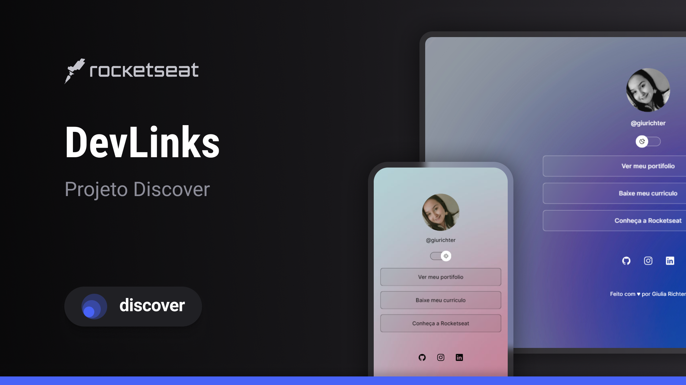

<h1 align="center"> Projeto DevLinks</h1>

Projeto exclusivo e gratuito, promovido pela Rocketseat para ensino de tecnologia WEB.

    

   

## 🚀 Tecnologias

Esse projeto foi desenvolvido com as seguintes tecnologias:

-> HTML e CSS
-> JavaScript
-> Git e Github
-> Figma

## 💻 Projeto

O DevLinks é um agregador de links para usar como cartão de visitas online.

## ✏️Layout 

Você pode visualizar o layout original do projeto criado pela Rockseat atraves [DESSE LINK](https://www.figma.com/community/file/1187422022288947321). É necessário ter conta no [Figma](https://www.figma.com/) para acessá-lo.

## :memo: Licença

Esse projeto está sob a licença MIT.